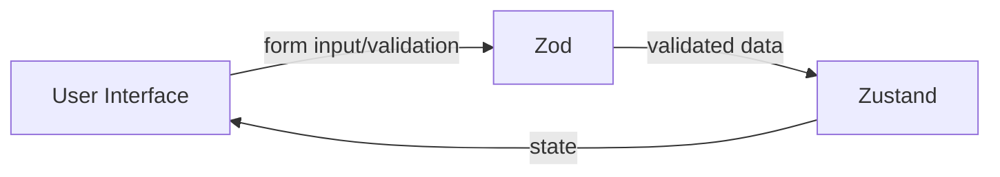
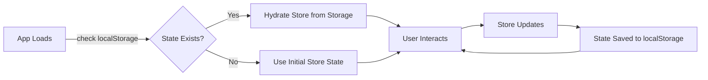
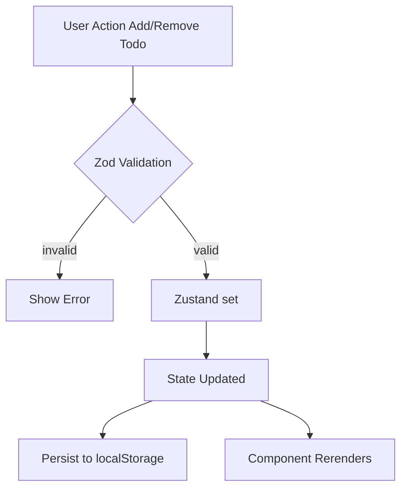
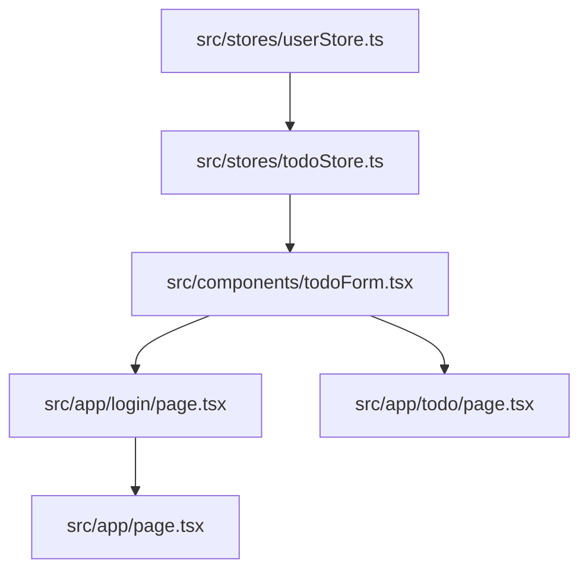

# Zustand + Zod POC

A simple and interactive proof-of-concept (POC) app demonstrating:

- **Zustand** for global state management
- **Zod** for schema validation
- Built with **Next.js** (App Router)

---

## 🚀 Quick Start

> 🟢 **Get started in seconds!**
>
> 1. Clone the repo
> 2. Install dependencies
> 3. Run the dev server

```bash
npm install
npm run dev
```

Visit [http://localhost:3000](http://localhost:3000)

---

## 🧠 Key Concepts



### Zustand (State Management)

- Manages user authentication and todos globally.
- Example usage:
  ```ts
  import { userStore } from "@/stores/userStore";
  const { user, login, logout } = userStore();
  ```

### Zod (Validation)

- Used for simple, type-safe validation of form input.
- Ensures only valid todos reach your app's state.
- Example:
  ```ts
  // src/utils/todoSchema.ts
  import { z } from "zod";
  export const todoSchema = z.object({
    title: z.string().min(3),
    dueDate: z.string(),
  });
  ```

---

## 🏪 Zustand (State Management, Updates & Persistence)

Zustand is the heart of state management in this POC. It’s minimal, powerful, and easy to use.

---

### ✨ How Zustand Works

#### 1️⃣ Store Creation

```ts
import { create } from "zustand";

export const useTodoStore = create((set) => ({
  todos: [],
  addTodo: (todo) => set((state) => ({ todos: [...state.todos, todo] })),
  removeTodo: (id) =>
    set((state) => ({ todos: state.todos.filter((t) => t.id !== id) })),
}));
```

> Create your store using `create()`. Define state and updater functions.

---

#### 2️⃣ Updating State

- Use the `set` function to update state.
- Any update triggers a rerender in components that use the changed state.

---

#### 3️⃣ Using State in Components

```ts
const { todos, addTodo } = useTodoStore();
addTodo(newTodo); // Updates state and rerenders subscribers
```

> Access and update state directly in your components.

---

#### 4️⃣ 🗄️ Persistence

- With `persist`, state is saved to localStorage and restored on reload.

```ts
import { persist } from "zustand/middleware";

export const useTodoStore = create(
  persist(
    (set) => ({
      /* ... */
    }),
    { name: "todo-store" }
  )
);
```

> Persist your state with a single middleware.

---

### 🛡️ Making Your Store Persistent

You can easily convert a normal Zustand store to a persistent one with a single change! This allows your state to survive page reloads by saving it to `localStorage` (or another storage backend).

**Before: Basic Store**
```ts
import { create } from "zustand";

export const useTodoStore = create((set) => ({
  todos: [],
  addTodo: (todo) => set((state) => ({ todos: [...state.todos, todo] })),
  removeTodo: (id) => set((state) => ({ todos: state.todos.filter(t => t.id !== id) })),
}));
```

**After: Persistent Store**
```ts
import { create } from "zustand";
import { persist } from "zustand/middleware";

export const useTodoStore = create(
  persist(
    (set) => ({
      todos: [],
      addTodo: (todo) => set((state) => ({ todos: [...state.todos, todo] })),
      removeTodo: (id) => set((state) => ({ todos: state.todos.filter(t => t.id !== id) })),
    }),
    { name: "todo-store" } // unique key in localStorage
  )
);
```

**How `persist` Works:**
- Wraps your store logic.
- Automatically saves state to `localStorage` (or your chosen storage) on every change.
- Restores state from storage when the app loads.



> 📝 **Tip:** You can customize what gets persisted and even use sessionStorage or custom storage engines!

---

#### 5️⃣ 🔄 Flow Overview



- **Validation happens at the UI/form layer, not in the store.**
- **No Redux-style middleware or action-wrapping is needed.**

---

#### 6️⃣ 💡 Why Not Zod in Store?

- Zustand is minimal and direct: state is updated via hooks, not dispatched actions.
- Validation is handled at the UI/form level (using Zod + React Hook Form) before any state update.
- This keeps store logic clean and focused only on state, not validation or side effects.
- If you need cross-cutting logic (like in Redux middleware), you can still add custom hooks or middleware, but for most apps, UI-level validation is simpler and more maintainable.

> **In short:**
>
> - In Zustand, validate in the UI, update in the store.
> - No need to wrap every add/update with Zod in the store—keep logic simple and predictable!

---

## 📁 Project Structure (Key Files)



- `src/stores/userStore.ts` — Zustand store for user state
- `src/stores/todoStore.ts` — Zustand store for todos
- `src/components/todoForm.tsx` — Todo form with Zod validation
- `src/app/login/page.tsx` — Login page
- `src/app/todo/page.tsx` — Todos dashboard
- `src/app/page.tsx` — Landing page

---

## 📝 How It Works

- **Login**: Simulated login updates global state
- **Todos**: Add, view, and manage todos (state persists)
- **Validation**: Todo form input is validated using Zod before adding
- **Conditional Routing**: Redirects based on auth state

### 🗂️ Todo Status Legend
- ✅ Completed todo
- ⏳ Pending todo
- 🗑️ Delete todo

---

## 💡 Why Zustand & Zod?

- **Zustand**: Minimal, scalable, and easy-to-use state management
- **Zod**: Type-safe, composable validation for forms and APIs

---
